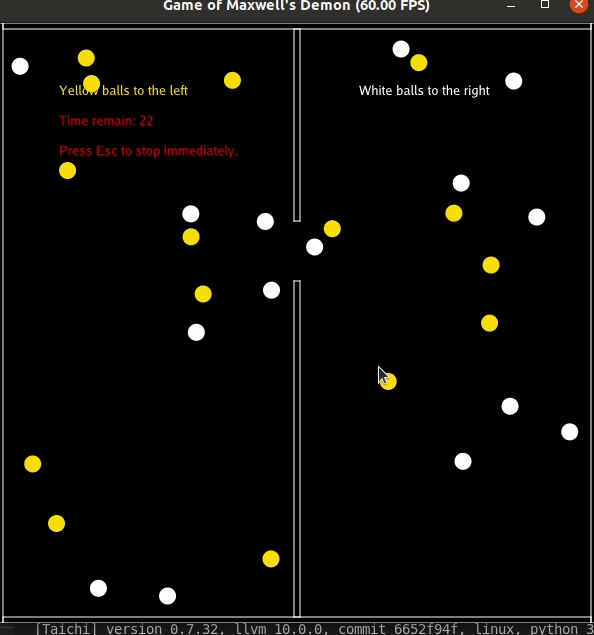

# Maxwell-Demon-Game
Powered by [Taichi](https://github.com/taichi-dev/taichi).
a simple keyboard game

This is hw2 of Taichi course, as a basic exercise of class.

## Rigid 2d bodies and resolve collision
Rigid bodies are non-deformable self-defined shapes, with no squashing or stretching allowed.

We provide a class Rigid2dBodies as general rigid bodies, and 2 shapes: Circles and AABB
(Axis Aligned Bounding Boxes) as specific examples.

We care about the collision between rigid bodies. Specifically, Impulse will be calculated and applied.

Sinking of objects are not dealt with due to time reason.

## Maxwell's Demon game
We simulate the movement of the balls in the game as 2d rigid circles with collision, instead of particles with repulsion. Walls are AABB with infinite mass.

## Playing the game
The game starts by running MaxwellsDemonGame.py.

Fixed number of white balls and yellow balls(default 15 each) are randomly generated. your goal is to move the door by pressing **UP** and **DOWN** on the keyboard, and get all yellow balls to the left side and all white balls to the right. Press **ESC** to stop game immediately.

The game ends when the player successfully move all balls to the correct side, or the time counts down to zero. Your final score is the number of balls in the correct side devided by the total number of balls.

